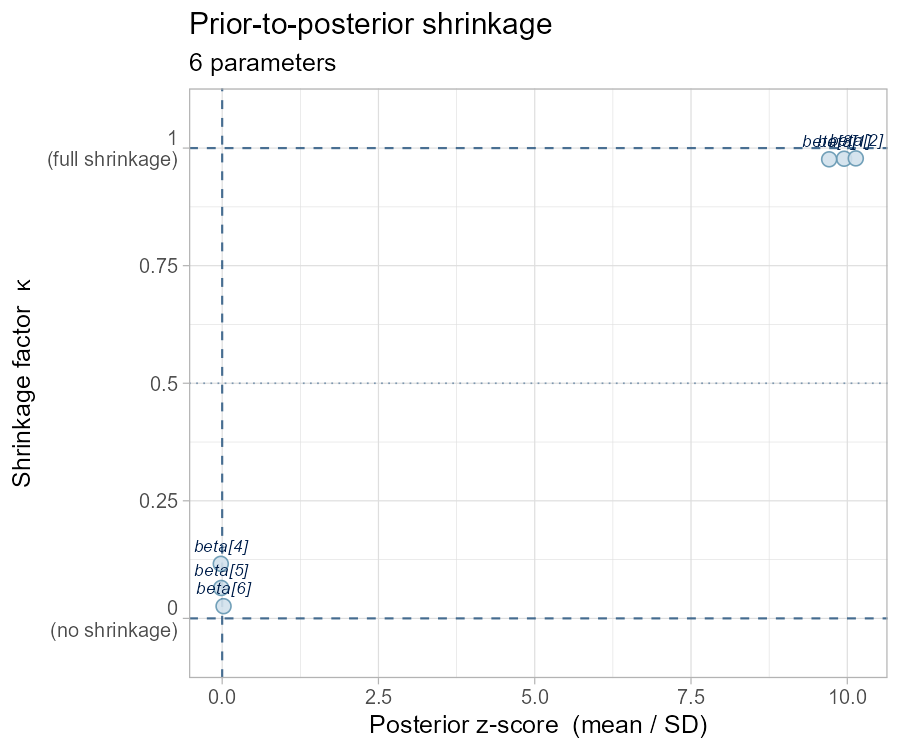
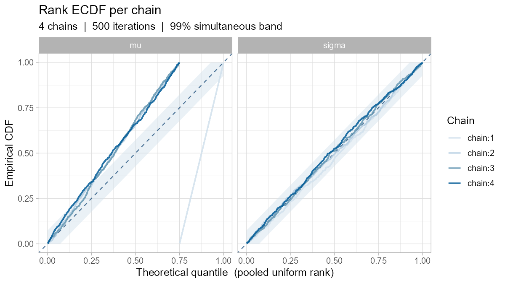

# bayesvis 

<!-- badges: start -->
[](https://github.com/example/bayesvis/actions)
[](https://codecov.io/gh/example/bayesvis)
[](https://www.gnu.org/licenses/gpl-3.0)
<!-- badges: end -->

**bayesvis** is a prototype extension for the
[bayesplot](https://mc-stan.org/bayesplot/) package, exploring advanced
Bayesian visualization capabilities that complement the existing
`mcmc_*` and `ppc_*` function families. All plots return **ggplot2** objects
and respect bayesplot's color scheme and theming system.

## Implemented functions

| Function | Category | Description |
|---|---|---|
| `mcmc_shrinkage()` | MCMC diagnostics | Prior-to-posterior shrinkage scatter |
| `compute_shrinkage()` | Helper | Compute shrinkage factors programmatically |
| `ppc_loo_pit()` | Posterior predictive checks | LOO-PIT histogram with uniform band |
| `ppc_loo_pit_qq()` | Posterior predictive checks | LOO-PIT Q-Q plot with Beta envelope |
| `mcmc_rank_ecdf()` | MCMC diagnostics | Per-chain rank ECDF with DKW bands |
| `ppc_coverage()` | Posterior predictive checks | Observation-level coverage plot |

## Installation

```r
# Install from local source (development)
# install.packages("remotes")
remotes::install_local("path/to/bayesvis")

# Or with devtools
devtools::install("path/to/bayesvis")
```

**Dependencies:** ggplot2, bayesplot, rlang, tibble

## Quick demo

```r
library(bayesvis)
library(bayesplot)

set.seed(42)
color_scheme_set("blue")

# ── Simulate MCMC draws ────────────────────────────────────────────────────
n_iter <- 1000

# Posterior draws: 3 well-identified + 3 weakly-identified parameters
posterior <- matrix(
  c(rnorm(n_iter * 3, mean = 1.5, sd = 0.15),  # high shrinkage
    rnorm(n_iter * 3, mean = 0.0, sd = 0.95)),  # low shrinkage
  ncol = 6
)
colnames(posterior) <- paste0("beta[", 1:6, "]")

# 1. Shrinkage diagnostic
mcmc_shrinkage(posterior, prior_sd = 1)
```



```r
# 2. LOO-PIT histogram  (well-calibrated model)
ppc_loo_pit(runif(200))

# 3. LOO-PIT Q-Q plot  (over-dispersed model)
ppc_loo_pit_qq(rbeta(200, 0.35, 0.35))

# 4. Rank ECDF — pathological chain 1
arr <- array(rnorm(500 * 4 * 1), dim = c(500, 4, 1),
             dimnames = list(NULL, paste0("chain:", 1:4), "mu"))
arr[, 1, 1] <- rnorm(500, mean = 8)   # chain 1 stuck
mcmc_rank_ecdf(arr, pars = "mu")
```



```r
# 5. Coverage plot
n   <- 60
y   <- rnorm(n, 2, 1)
rep <- matrix(rnorm(500 * n, 2, 1), nrow = 500)
ppc_coverage(y, rep, prob = 0.90)
```

## Color schemes

bayesvis inherits bayesplot's color scheme system:

```r
color_scheme_set("red")
ppc_loo_pit(runif(100))

color_scheme_set("teal")
mcmc_shrinkage(posterior, prior_sd = 1)
```

All schemes from `bayesplot::color_scheme_set()` work out of the box.

## Extending the plots

Because every function returns a ggplot2 object, you can layer on top:

```r
library(ggplot2)

mcmc_shrinkage(posterior, prior_sd = 1) +
  geom_hline(yintercept = 0.8, color = "firebrick", linetype = "dotdash") +
  annotate("text", x = 3, y = 0.82, label = "threshold", color = "firebrick")
```

## Statistical background

- **Shrinkage**: Piironen & Vehtari (2017), *Statistics and Computing*
  [doi:10.1007/s11222-016-9649-y](https://doi.org/10.1007/s11222-016-9649-y)
- **LOO-PIT**: Vehtari, Gelman & Gabry (2017), *Statistics and Computing*
  [doi:10.1007/s11222-016-9696-4](https://doi.org/10.1007/s11222-016-9696-4)
- **Rank ECDF**: Vehtari et al. (2021), *Bayesian Analysis*
  [doi:10.1214/20-BA1221](https://doi.org/10.1214/20-BA1221)
- **Visualization workflow**: Gabry et al. (2019), *JRSS-A*
  [doi:10.1111/rssa.12378](https://doi.org/10.1111/rssa.12378)

## Relationship to bayesplot

bayesvis is a **prototype** exploring directions for extending bayesplot.
The goal is to demonstrate that these diagnostics fit naturally into the
bayesplot interface and color scheme ecosystem. Functions follow identical
conventions to bayesplot (`snake_case`, `mcmc_*`/`ppc_*` prefixes, ggplot2
output, bayesplot theming).

## License

GPL (≥ 3)
