# Extended Bayesian Visualization: Diagnostics Beyond Trace Plots

## Overview

The **bayesvis** package extends
[bayesplot](https://mc-stan.org/bayesplot/) with a set of diagnostic
visualizations that go beyond the familiar trace plot. This vignette
walks through each function using simulated MCMC draws with *known*
properties—some well-behaved, some deliberately pathological—so you can
see exactly what signal each plot is designed to surface.

``` r
# Load bayesplot first so bayesvis functions take precedence in the search path
library(bayesplot)
#> This is bayesplot version 1.15.0
#> - Online documentation and vignettes at mc-stan.org/bayesplot
#> - bayesplot theme set to bayesplot::theme_default()
#>    * Does _not_ affect other ggplot2 plots
#>    * See ?bayesplot_theme_set for details on theme setting
library(bayesvis)
#> 
#> Attaching package: 'bayesvis'
#> The following object is masked from 'package:bayesplot':
#> 
#>     mcmc_rank_ecdf

# Use a muted color scheme throughout
color_scheme_set("blue")
```

------------------------------------------------------------------------

## Simulated MCMC draws

All examples use the following synthetic data so you can reproduce every
figure without a Stan model.

``` r
n_iter   <- 1000L   # MCMC iterations per chain
n_chains <- 4L      # number of chains
n_obs    <- 80L     # observations

# ── Posterior draws ──────────────────────────────────────────────────────────
# Six parameters, varying degrees of identifiability.
# beta[1]–beta[3]: well identified (posterior SD << prior SD of 1)
# beta[4]–beta[6]: weakly identified (posterior SD ≈ prior SD of 1)
posterior_2d <- matrix(
  c(
    rnorm(n_iter, mean =  1.5, sd = 0.12),   # beta[1]
    rnorm(n_iter, mean = -0.8, sd = 0.18),   # beta[2]
    rnorm(n_iter, mean =  2.1, sd = 0.22),   # beta[3]
    rnorm(n_iter, mean =  0.1, sd = 0.94),   # beta[4]
    rnorm(n_iter, mean = -0.2, sd = 0.98),   # beta[5]
    rnorm(n_iter, mean =  0.3, sd = 0.91)    # beta[6]
  ),
  ncol = 6L
)
colnames(posterior_2d) <- paste0("beta[", 1:6, "]")
prior_sd <- rep(1, 6)

# ── Well-mixing 3D array ─────────────────────────────────────────────────────
# Four chains, two parameters: draws are i.i.d. so mixing is perfect.
good_array <- array(
  rnorm(n_iter * n_chains * 2),
  dim      = c(n_iter, n_chains, 2L),
  dimnames = list(NULL, paste0("chain:", 1:4), c("mu", "sigma"))
)

# ── Badly-mixing 3D array ────────────────────────────────────────────────────
# Chain 1 for "mu" is stuck in a completely different region.
bad_array         <- good_array
bad_array[, 1, 1] <- rnorm(n_iter, mean = 8, sd = 0.15)

# ── Observed data and posterior predictive draws ─────────────────────────────
y_true <- 2
y      <- rnorm(n_obs, mean = y_true, sd = 1)

# Well-calibrated model: yrep drawn from the same distribution as y
yrep_good   <- matrix(rnorm(500L * n_obs, mean = y_true, sd = 1), nrow = 500L)

# Over-confident model: posterior predictive intervals too narrow
yrep_narrow <- matrix(rnorm(500L * n_obs, mean = y_true, sd = 0.25), nrow = 500L)

# ── LOO-PIT values ────────────────────────────────────────────────────────────
# Well-calibrated ≈ Uniform(0,1)
pit_good  <- runif(n_obs)
# Over-dispersed: PIT concentrated near 0 and 1
pit_over  <- rbeta(n_obs, shape1 = 0.35, shape2 = 0.35)
# Under-dispersed: PIT concentrated near 0.5
pit_under <- rbeta(n_obs, shape1 = 5, shape2 = 5)
```

------------------------------------------------------------------------

## 1. `mcmc_shrinkage()` — Prior-to-posterior shrinkage

### Statistical motivation

The **shrinkage factor**
$$\kappa_{\theta} = 1 - \frac{\widehat{\operatorname{Var}}(\theta \mid y)}{\widehat{\operatorname{Var}}(\theta)}$$
measures how much the posterior has contracted relative to the prior.

- $\kappa \approx 1$: the data are highly informative for $\theta$
  (posterior much tighter than prior).
- $\kappa \approx 0$: the posterior barely updated from the prior
  (weakly identified parameter).

Plotting $\kappa$ against the posterior z-score
$z_{\theta} = {\bar{\theta}}_{\text{post}}/\widehat{\text{SD}}(\theta \mid y)$
reveals the signal-to-noise ratio of each parameter simultaneously.

### Good example — high and low shrinkage

``` r
mcmc_shrinkage(posterior_2d, prior_sd = prior_sd)
```

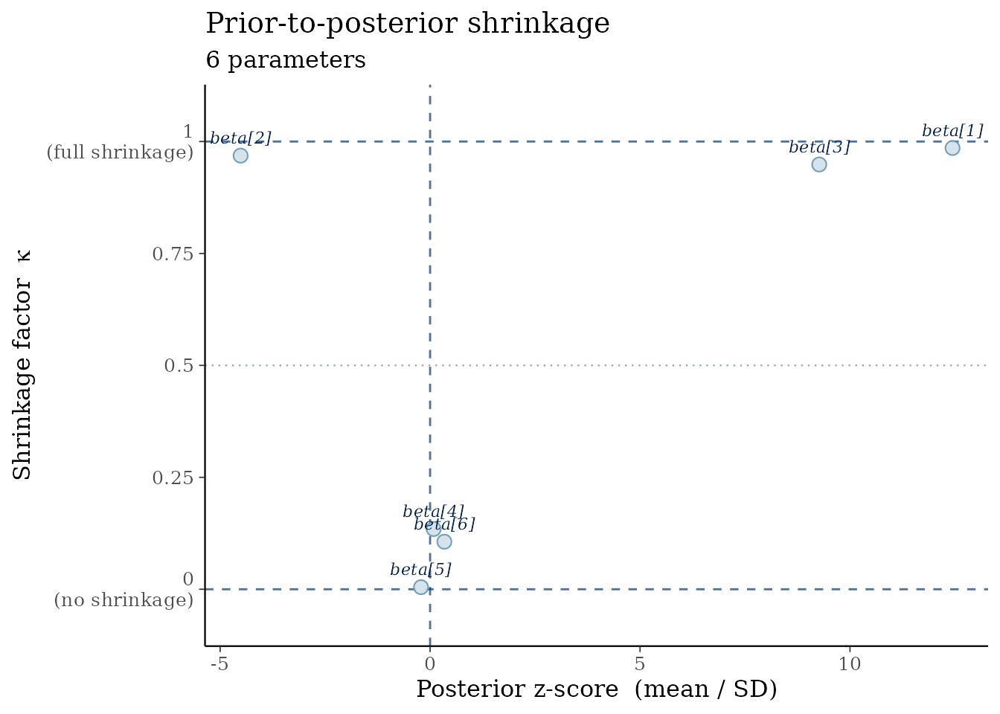

Parameters `beta[1]`–`beta[3]` cluster near $\kappa = 1$: the data drive
the posterior far from the prior. Parameters `beta[4]`–`beta[6]` sit
near $\kappa = 0$: the posterior is essentially the prior, signalling
weak identifiability.

### Using prior draws instead of closed-form prior SDs

When the prior is non-standard or specified implicitly, pass prior
draws:

``` r
prior_draws <- matrix(rnorm(n_iter * 6, sd = 1), ncol = 6)
colnames(prior_draws) <- colnames(posterior_2d)

mcmc_shrinkage(posterior_2d, prior_draws = prior_draws)
```

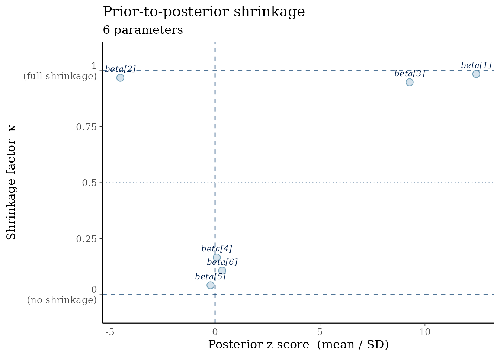

### Computing shrinkage programmatically

``` r
kappa <- compute_shrinkage(posterior_2d, prior_sd = prior_sd)
round(kappa, 3)
#> beta[1] beta[2] beta[3] beta[4] beta[5] beta[6] 
#>   0.986   0.968   0.949   0.135   0.005   0.106
```

------------------------------------------------------------------------

## 2. `ppc_pit_hist()` — LOO-PIT histogram

### Statistical motivation

The **probability integral transform** (PIT) applied to leave-one-out
predictive distributions produces values that should be
$\text{Uniform}(0,1)$ for a well-calibrated model (Vehtari et al. 2017).
Systematic deviations point to:

- **U-shaped histogram** → over-dispersed predictive distribution (model
  underestimates uncertainty).
- **Hump-shaped histogram** → under-dispersed predictive distribution
  (model overestimates certainty).

The shaded band is the $95\%$ binomial confidence region around the
expected uniform density.

### Well-calibrated model

``` r
ppc_pit_hist(pit_good)
```

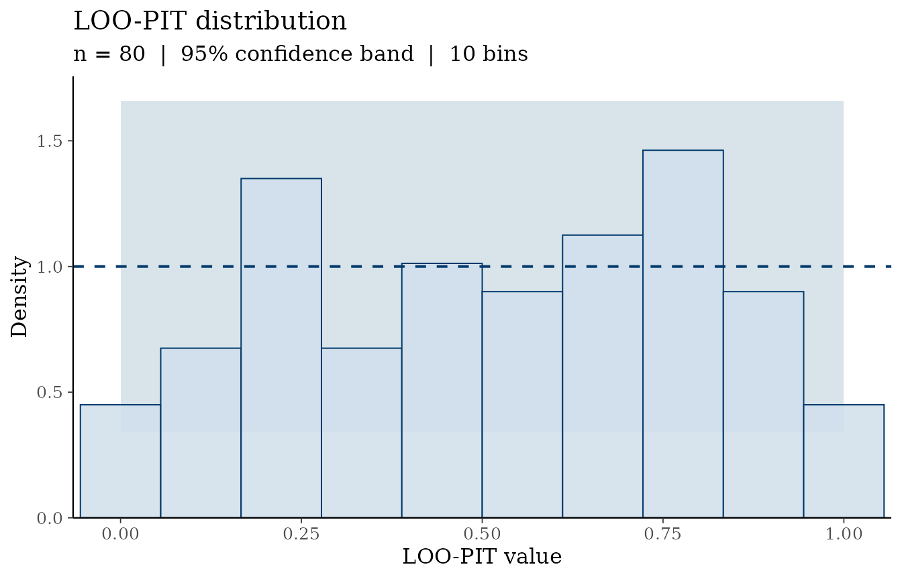

Bars are scattered around the reference line and mostly within the band.

### Over-dispersed model

``` r
ppc_pit_hist(pit_over, bins = 12L)
```

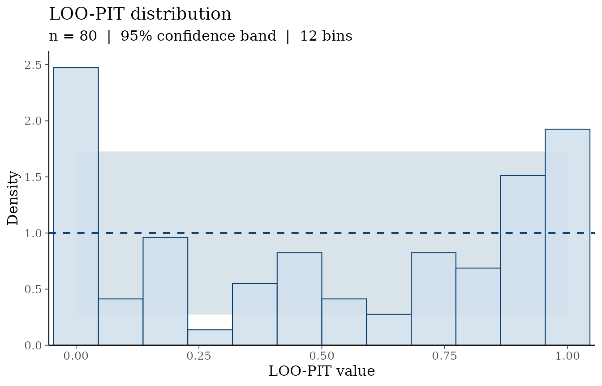

The U-shape reveals that observed values tend to lie in the tails of the
predictive distribution — the model’s intervals are too wide.

### Under-dispersed model

``` r
ppc_pit_hist(pit_under, bins = 12L)
```

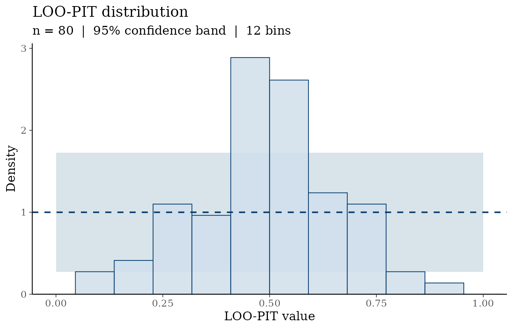

The central hump reveals over-confidence: observations cluster near the
center of the predictive distribution.

------------------------------------------------------------------------

## 3. `ppc_pit_qq()` — LOO-PIT Q-Q plot

The Q-Q version is more sensitive than the histogram for detecting
subtle calibration failures, especially in the tails.

``` r
ppc_pit_qq(pit_good)
```

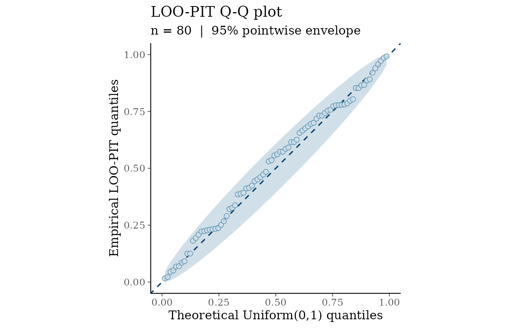

``` r
ppc_pit_qq(pit_over)
```

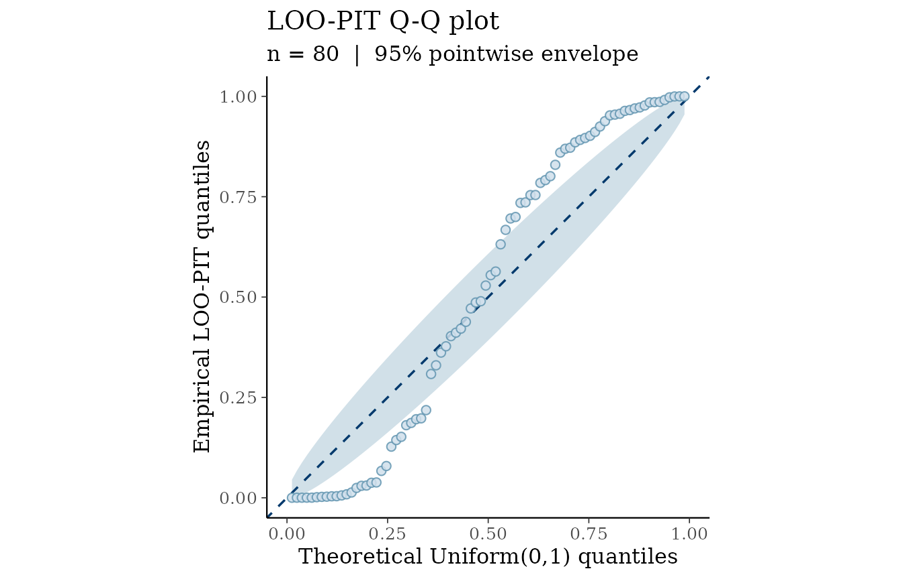

The S-shaped curve for the over-dispersed case (points dip below the
diagonal at low quantiles and rise above at high quantiles) is a classic
signature of U-shaped PIT distributions.

------------------------------------------------------------------------

## 4. `mcmc_rank_ecdf()` — Rank ECDF per chain

### Statistical motivation

Vehtari et al. (2021) propose diagnosing MCMC mixing via *rank
statistics*: pool all draws across chains, rank them, and examine
whether the ranks are uniformly distributed within each chain. Under
ideal mixing, each chain’s ECDF of ranks should track the diagonal.

[`mcmc_rank_ecdf()`](https://utkarshpawade.github.io/bayesvis/reference/mcmc_rank_ecdf.md)
plots the per-chain ECDFs with a simultaneous confidence band based on
the DKW inequality: $$\varepsilon = \sqrt{\frac{\log(2/\alpha)}{2I}}$$
where $I$ is the number of iterations per chain and
$\alpha = 1 - \text{prob}$.

### Well-mixing chains

``` r
mcmc_rank_ecdf(good_array, prob = 0.99)
```

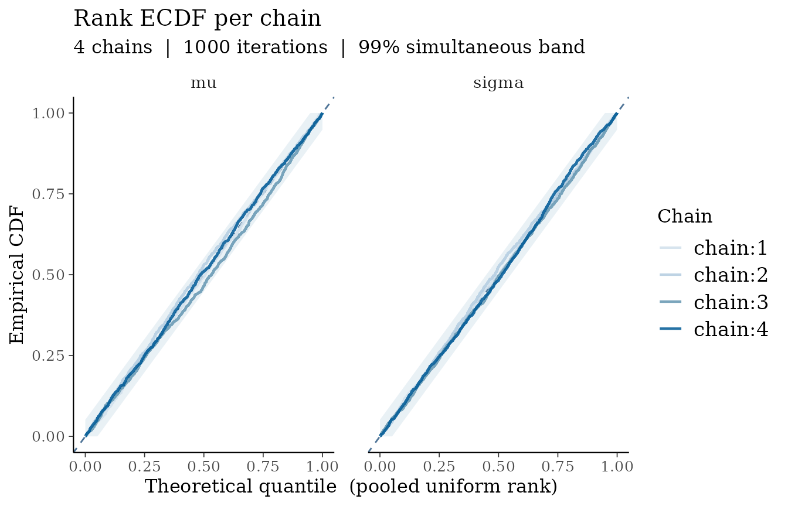

All four chain ECDFs overlap and stay within the grey band — textbook
mixing.

### Badly mixing chains (chain 1 stuck)

``` r
mcmc_rank_ecdf(bad_array, prob = 0.99)
```

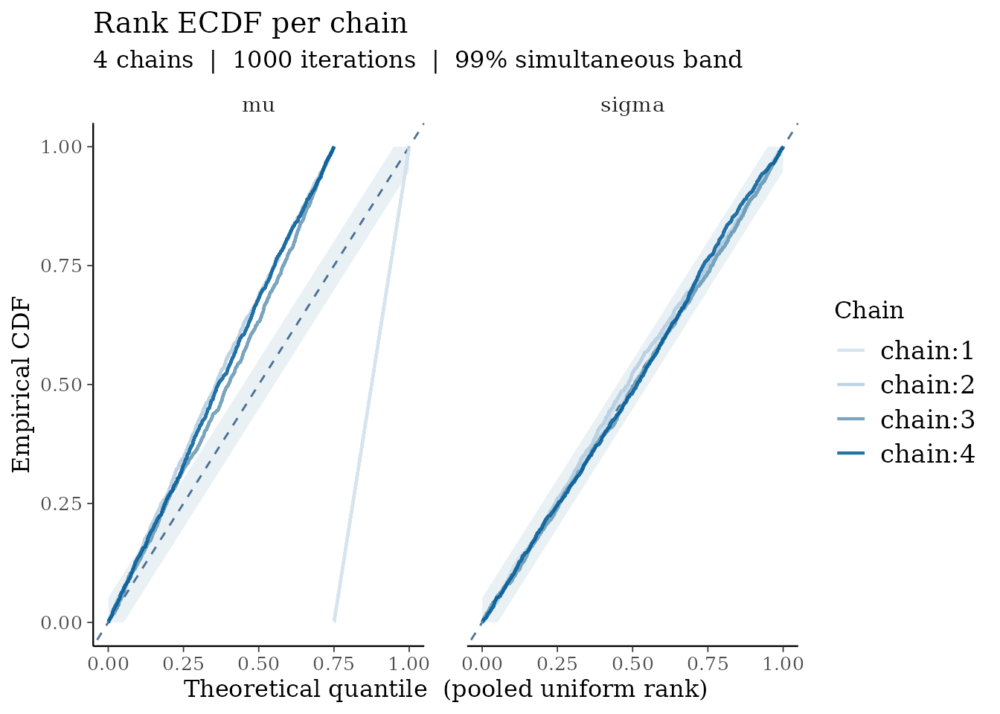

For `mu`, chain 1 (blue) rockets to 1 immediately because all of its
draws have the highest ranks (it was stuck at $\mu = 8$ while other
chains were near 0). The other chains’ ECDFs are pushed below the
diagonal to compensate. This is impossible to miss, even without a trace
plot.

### Selecting individual parameters

``` r
mcmc_rank_ecdf(bad_array, pars = "sigma")
```

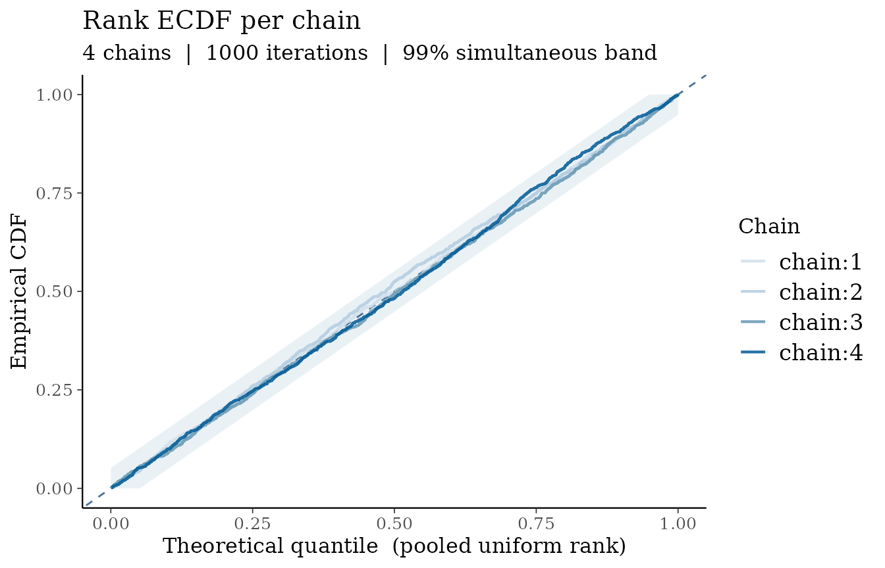

`sigma` is well-mixing — the problem is isolated to `mu`, which
[`mcmc_rank_ecdf()`](https://utkarshpawade.github.io/bayesvis/reference/mcmc_rank_ecdf.md)
makes immediately apparent.

------------------------------------------------------------------------

## 5. `ppc_coverage()` — Posterior predictive coverage

### Statistical motivation

A $p\%$ posterior predictive interval should cover approximately $p\%$
of observations (Gabry et al. 2019).
[`ppc_coverage()`](https://utkarshpawade.github.io/bayesvis/reference/ppc_coverage.md)
makes this concrete by drawing the credible interval for every
observation and coloring it by whether the observed value falls inside.

- **Empirical coverage ≈ nominal**: model is well-calibrated.
- **Empirical coverage \< nominal**: model is over-confident.
- **Empirical coverage \> nominal**: model is conservative.

### Well-calibrated model (≈ 90% coverage expected)

``` r
ppc_coverage(y, yrep_good, prob = 0.90)
```

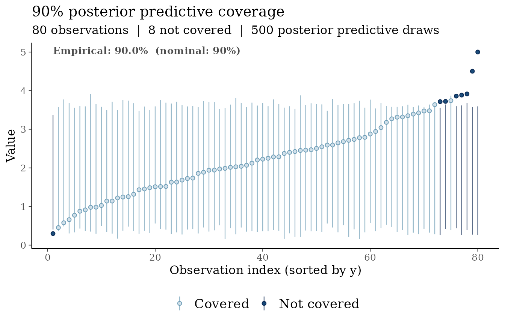

The annotated empirical rate should be close to 90%.

### Over-confident model (intervals too narrow)

``` r
ppc_coverage(y, yrep_narrow, prob = 0.90)
```

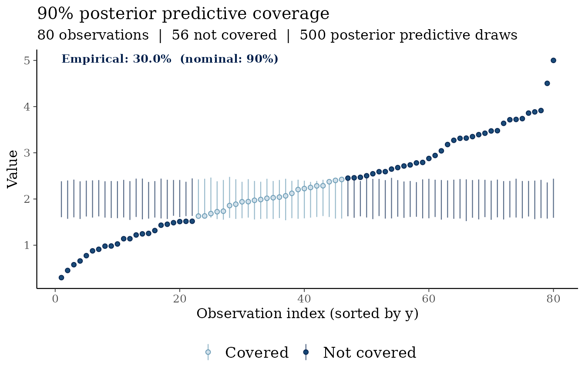

The majority of observations are **not covered** (red/dark), and the
annotated empirical rate is far below 90%, signalling that the posterior
predictive distribution is too narrow.

### Sorting options

``` r
ppc_coverage(y, yrep_good, sort_by = "mean")
```

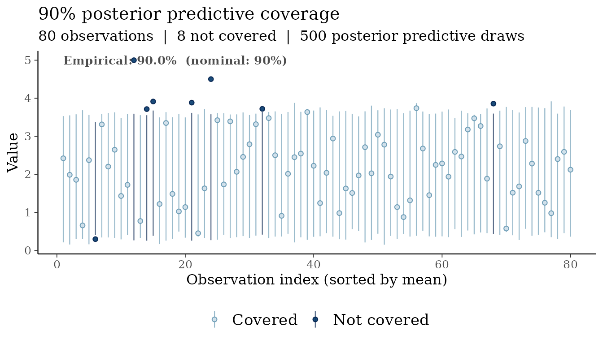

Sorting by posterior predictive mean can reveal whether miscoverage is
systematic across the range of predicted values.

------------------------------------------------------------------------

## Combining with bayesplot color schemes

All **bayesvis** plots respect
[`bayesplot::color_scheme_set()`](https://mc-stan.org/bayesplot/reference/bayesplot-colors.html):

``` r
color_scheme_set("red")
ppc_pit_hist(pit_under)
```

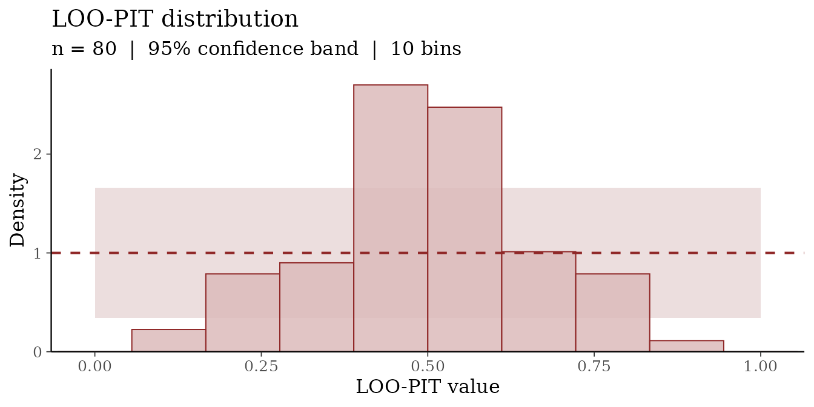

------------------------------------------------------------------------

## References

Gabry, J., Simpson, D., Vehtari, A., Betancourt, M., and Gelman, A.
(2019). Visualization in Bayesian workflow. *Journal of the Royal
Statistical Society Series A*, 182(2), 389–402.
<https://doi.org/10.1111/rssa.12378>

Piironen, J. and Vehtari, A. (2017). Comparison of Bayesian predictive
methods for model selection. *Statistics and Computing*, 27(3), 711–735.
<https://doi.org/10.1007/s11222-016-9649-y>

Vehtari, A., Gelman, A., and Gabry, J. (2017). Practical Bayesian model
evaluation using leave-one-out cross-validation and WAIC. *Statistics
and Computing*, 27(5), 1413–1432.
<https://doi.org/10.1007/s11222-016-9696-4>

Vehtari, A., Gelman, A., Simpson, D., Carpenter, B., and Bürkner, P.-C.
(2021). Rank-normalization, folding, and localization: An improved R-hat
for assessing convergence of MCMC (with discussion). *Bayesian
Analysis*, 16(2), 667–718. <https://doi.org/10.1214/20-BA1221>
